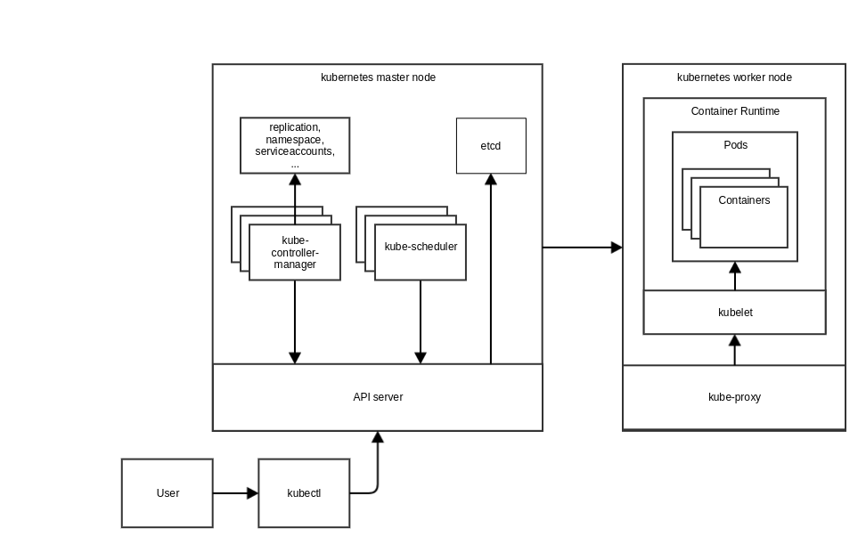

# Illuminatio - The kubernetes network policy validator

Illuminatio is an tool for automatically testing kubernetes network policies. 
Simply execute `illuminatio run clean` 
and Illuminatio will scan your kubernetes cluster for network policies, build test cases accordingly and execute them
to determine if the policies are in effect.

Here you see a simple kubernetes cluster that you can interact with using kubectl.


Illuminatio now interacts with your cluster to validate existing networkpolicies:


# Getting started
Follow these instructions to get Illuminatio up and running.

## Prerequisites

- Python 3
- Pip 3

## Installation

with pip:
```
pip3 install illuminatio
```

or directly from the repository:
```
git clone https://github.com/inovex/illuminatio
cd illuminatio
python3 setup.py install
cd ..
```

## Example Usage

Create a Deployment to test with:
```
kubectl create deployment web --image=nginx
kubectl expose deployment web --port 80 --target-port 80
```

Define and create a NetworkPolicy for your Deployment:
```
cat <<EOF | kubectl create -f -
kind: NetworkPolicy
apiVersion: networking.k8s.io/v1
metadata:
  name: web-deny-all
spec:
  podSelector:
    matchLabels:
      app: web
  ingress: []
EOF
```

Test your newly created NetworkPolicy:
```bash
$ illuminatio clean run
```
```
Starting cleaning resources with policies ['on-request', 'always']
Deleting namespacess [] with cleanup policy on-request
Deleting namespacess [] with cleanup policy always
Deleting DSs in default with cleanup policy on-request
Deleting pods in default with cleanup policy on-request
Deleting svcs in default with cleanup policy on-request
Deleting CfgMaps in default with cleanup policy on-request
Deleting CRBs  with cleanup policy on-request globally
Deleting SAs in default with cleanup policy on-request
Deleting DSs in default with cleanup policy always
Deleting pods in default with cleanup policy always
Deleting svcs in default with cleanup policy always
Deleting CfgMaps in default with cleanup policy always
Deleting CRBs  with cleanup policy always globally
Deleting SAs in default with cleanup policy always
Finished cleanUp

Starting test generation and run.
Got cases: [NetworkTestCase(from=ClusterHost(namespace=default, podLabels={'app': 'web'}), to=ClusterHost(namespace=default, podLabels={'app': 'web'}), port=-*)]
Generated 1 cases in 0.0701 seconds
FROM             TO               PORT
default:app=web  default:app=web  -*  

Using existing cluster role
Creating cluster role binding
TestResults: {'default:app=web': {'default:app=web': {'-*': {'success': True}}}}
Finished running 1 tests in 18.7413 seconds
FROM             TO               PORT  RESULT   
default:app=web  default:app=web  -*    success
```
The `clean` keyword assures that illuminatio clears all potentially existing resources created in past illuminatio runs to prevent potential issues, however no user generated resources are affected.

*PLEASE NOTE* that currently each new run requires a clean, as the runners do not continuously look for new cases.

For the case that you really want to keep the generated resources you are free to omit the `clean` keyword.

If you are done testing you might want to easily delete all resources created by illuminatio:
```bash
illuminatio clean
```

To preview generated test cases without running tests use `illuminatio run`'s `--dry` option:

```bash
illuminatio run --dry
```
```
Starting test generation and run.
Got cases: [NetworkTestCase(from=ClusterHost(namespace=default, podLabels={'app': 'web'}), to=ClusterHost(namespace=default, podLabels={'app': 'web'}), port=-*)]
Generated 1 cases in 0.0902 seconds
FROM             TO               PORT
default:app=web  default:app=web  -*  

Skipping test exection as --dry was set
```

All options and further information can be found using the `--help` flag on any level:

```bash
illuminatio --help
```
```
Usage: illuminatio [OPTIONS] COMMAND1 [ARGS]... [COMMAND2 [ARGS]...]...

Options:
  -v, --verbosity LVL  Either CRITICAL, ERROR, WARNING, INFO or DEBUG
  --incluster
  --help               Show this message and exit.

Commands:
  clean
  run
```

# Developing Illuminatio

## Prerequisites

- Python 3
- [virtualenv](https://docs.python-guide.org/dev/virtualenvs/#lower-level-virtualenv)
- [minikube](https://github.com/kubernetes/minikube) (tested with version: v0.34.1)

## Setting up the development environment

```bash
virtualenv -p python3 .venv
source .venv/bin/activate
pip3 install -r requirements.txt
```

Now you can install the Illuminatio client:

```bash
python3 setup.py install
```

## Local development
We will bootstrap a [Minikube VM](https://kubernetes.io/docs/setup/minikube/) for local development.

### [Docker](https://github.com/inovex/illuminatio/local_dev/startDocker.sh)

```bash
# See also: https://github.com/projectcalico/calico/issues/1013
minikube start \
    --network-plugin=cni \
    --extra-config=kubelet.network-plugin=cni \
    --extra-config=kubelet.pod-cidr=192.168.0.0/16 \
    --extra-config=controller-manager.allocate-node-cidrs=true \
    --extra-config=controller-manager.cluster-cidr=192.168.0.0/16 \
    --bootstrapper=kubeadm \
    --host-only-cidr=172.17.17.1/24 \
    --insecure-registry=localhost:5000

# Adding a local Docker Registry
minikube addons enable registry
```

### [Containerd](https://github.com/inovex/illuminatio/local_dev/startContainerd.sh)

See also: https://github.com/kubernetes/minikube/blob/master/docs/alternative_runtimes.md

```bash
# See also: https://github.com/projectcalico/calico/issues/1013
minikube start \
    --network-plugin=cni \
    --container-runtime=containerd \
    --cri-socket=/run/containerd/containerd.sock \
    --extra-config=kubelet.container-runtime=remote \
    --extra-config=kubelet.container-runtime-endpoint=unix:///run/containerd/containerd.sock \
    --extra-config=kubelet.image-service-endpoint=unix:///run/containerd/containerd.sock \
    --extra-config=kubelet.network-plugin=cni \
    --extra-config=kubelet.pod-cidr=192.168.0.0/16 \
    --extra-config=controller-manager.allocate-node-cidrs=true \
    --extra-config=controller-manager.cluster-cidr=192.168.0.0/16 \
    --bootstrapper=kubeadm \
    --host-only-cidr=172.17.17.1/24 \
    --insecure-registry=localhost:5000

# Adding a local Docker Registry
minikube addons enable registry
```

If you want to interact with `containerd` you can use `minikube ssh` to ssh into the minikube VM and run `sudo crictl -r unix:///run/containerd/containerd.sock pods` (or other `crictl` commands).

## Networking

Installing Calico (or other [CNI network plugins](https://kubernetes.io/docs/concepts/cluster-administration/networking/#how-to-implement-the-kubernetes-networking-model)) for example:

```bash
# actually we don't need the rbac rules since minikube has rbac deactivated per default
kubectl apply -f https://docs.projectcalico.org/v3.5/getting-started/kubernetes/installation/hosted/kubernetes-datastore/calico-networking/1.7/calico.yaml
```

## Use the local Docker daemon

In order to test newly build runner images we need to use the [Minikube Docker daemon](https://github.com/kubernetes/minikube/blob/master/docs/reusing_the_docker_daemon.md):

```bash
eval $(minikube docker-env)
```

And also deploy a local docker regisrty:

```bash
kubectl apply -f local_dev/docker-registry.yml
```

**This step is only required for containerd**
We need to configure `containerd` to be able to pull images from our local registry:

```bash
minikube ssh
```
The following commands are executed inside the minikube vm
```bash
# Add the following lines -> see https://github.com/kubernetes/minikube/issues/3444
sudo sed -i '56i\          endpoint = ["http://localhost:5000"]' /etc/containerd/config.toml  
sudo sed -i '56i\       [plugins.cri.registry.mirrors."localhost"]' /etc/containerd/config.toml  
# Finally restart the containerd service
sudo systemctl restart containerd
# check everythin worked:
sudo systemctl status containerd
```

Now we can build locally the new runner image:

```bash
docker build -t "localhost:5000/illuminatio-runner:dev" -f illuminatio-runner.dockerfile .
```

And if you run the following command you should see the new image `docker images`.
In order to be able to pull the image from the local registry we need to push the image there:

```bash
docker push "localhost:5000/illuminatio-runner:dev"
```

If you change code on the orchestrator run:

```bash
python3 setup.py install
```

## Manual testing

<!-- TODO should be automated or atleast a script for CI -->

```bash
kubectl create deployment web --image=nginx
kubectl expose deployment web --port 80 --target-port 80

cat <<EOF | kubectl create -f -
kind: NetworkPolicy
apiVersion: networking.k8s.io/v1
metadata:
  name: web-deny-all
spec:
  podSelector:
    matchLabels:
      app: web
  ingress: []
EOF

${PWD}/.venv/bin/illuminatio run --runner-image='localhost:5000/illuminatio-runner:dev'
```

## Unit Tests

In order to run the unit tests:

```bash
python3 setup.py test --addopts --runslow
```

## Contributing
We are happy to read your [issues](https://github.com/inovex/illuminatio/issues) and accept your [Pull Requests.](https://github.com/inovex/illuminatio/compare)
